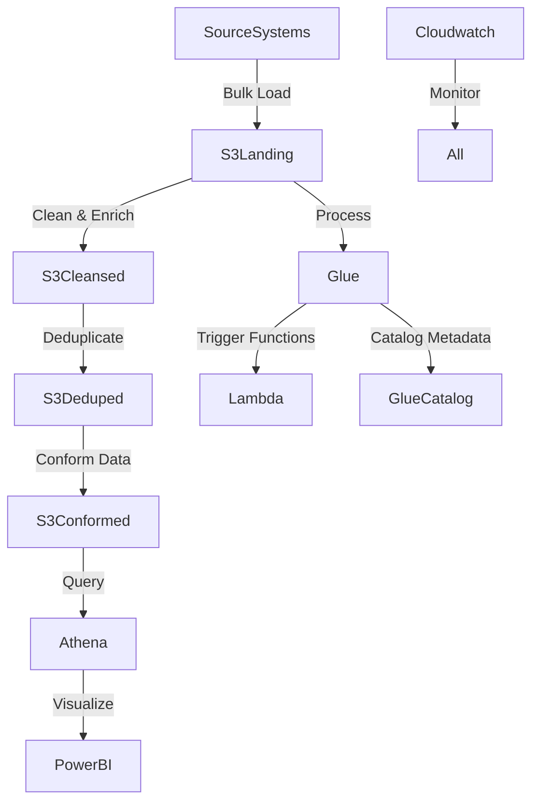

# 🎥💡 YouTube Analytics Data Pipeline & Regional Correlation Dashboard

🚀 This project integrates an **AWS-based data pipeline** with **Python analysis** and an **interactive Power BI dashboard** to study **YouTube audience engagement** across **11 regions** and **600+ channels**.  

It combines **cloud engineering (AWS S3, Glue, Lambda, Athena)**, **data analysis (Python, Pandas, Seaborn, Matplotlib)**, and **BI storytelling (Power BI)** to uncover:  
- **Correlations** between views, likes, dislikes, and comments.  
- **Regional audience behavior** across 600+ channels.  
- **Channel-level dominance & volatility** in engagement.  


📌 [LinkedIn slides](https://www.linkedin.com/feed/update/urn:li:activity:7372924595622035456/)

---

## 📌 Navigation  
<div align="center">  

| Section | Link |  
|---------|------|  
| **Part 1 – Data Analysis** | [Go to Data Analysis](#-part-1-data-analysis--correlation--regional-insights) |  
| **Notebook Breakdown** | [Go to Notebook Breakdown](#-notebook-breakdown-eda_youtubeipynb) |  
| **Interactive Dashboard** | [View Dashboard](#-power-bi-dashboard) |  
| **Part 2 – Data Engineering** | [Go to Data Engineering](#-part-2-data-engineering--aws-pipeline--glue-etl) |  
</div>  

---

## 🎯 Problem Statement & Objectives  

Analyzing **trending YouTube videos** requires more than raw counts. The data is **fragmented across 11 regions**, messy, and schema-inconsistent. To generate real insights, we need both:  
- A **scalable AWS pipeline** to clean and prepare data.  
- A **robust analysis framework** to study correlations, volatility, and cultural differences.  

### Objectives  
✅ Ingest & clean raw YouTube trending data.  
✅ Process and transform 22 files (176 parameters) using AWS Glue and Lambda.  
✅ Perform correlation & regional analysis on 600+ channels (102B views, 3B likes, 283M comments, 119M dislikes).  
✅ Build an interactive Power BI dashboard for engagement insights.  

---

## 🔹 Part 1: Data Analysis – Correlation & Regional Insights  

### 🎯 Why Analyze YouTube Data?  
YouTube is not just about views — audience engagement is multi-dimensional: people **watch**, **like**, **dislike**, and **comment** on content differently across cultures. Studying these metrics together tells us:  
- Which behaviors **predict success** (e.g., do likes always follow views?).  
- How audiences **differ by region** (active participation vs passive watching).  
- Where **volatility** comes from (polarizing creators, viral spikes).  

This analysis covers **600+ YouTube channels across 11 regions**, focusing on **relationships between engagement metrics** and **regional differences**.  

---

### 📊 Dataset & Scope  
- **22 files (CSV/JSON)** processed with AWS Glue  
- **176 parameters** harmonized  
- **600+ YouTube channels analyzed**  
- **102B views, 3B likes, 283M comments, 119M dislikes** studied  

---

### 🧪 Notebook Breakdown (EDA_Youtube.ipynb)  
📂 [Open in Google Colab](https://colab.research.google.com/drive/14S8sAlns6IKeyAQpyRVNt_Svsk4F3SSj?usp=sharing)  

---

### Analysis Steps  

#### 1. Data Cleaning  
```python
import pandas as pd

df = pd.read_csv("USvideos.csv")
df = df.drop_duplicates()
df['comment_count'] = df['comment_count'].fillna(0)
```
👉 Unified dataset across 11 regions.  

#### 2. Engagement Metric Exploration  
```python
df[['views','likes','dislikes','comment_count']].describe()
```
- Views skewed → viral spikes dominate.  
- Likes scale with views.  
- Comments sparse; dislikes weak.  

#### 3. Correlation Analysis  
```python
import seaborn as sns, matplotlib.pyplot as plt
corr = df[['views','likes','dislikes','comment_count']].corr()
sns.heatmap(corr, annot=True, cmap="coolwarm")
```
- Views ↔ Likes = strongest.  
- Comments = cultural.  
- Dislikes = weakest.  

#### 4. Variance & Trend Modeling  
```python
df.groupby('channel_title')[['views','likes']].var().sort_values(by='views', ascending=False).head(5)
```
- High variance = polarized/viral creators.  

#### 5. Regional Segmentation  
```python
df.groupby('region')[['views','likes','dislikes','comment_count']].mean()
```
- Americas → comment-heavy.  
- Europe → more dislikes.  
- Asia → massive views, lower engagement ratios.  

#### 6. Channel-Level Insights  
```python
df.groupby('channel_title')['views'].sum().sort_values(ascending=False).head(5)
```
- Top: SpaceX, PewDiePie, Vevo, xxxtentacion.  

---

### 📈 Key Insights  
- Likes = strongest predictor of success.  
- Comments = region-driven (culture matters).  
- Dislikes = weak signal globally.  
- Volatility reveals polarized creators.  
- Audience reactions differ by region.  

---

### 📸 Power BI Dashboard  
  
  
Features: KPIs, filters, correlation matrices, regional breakdowns, top channels.  

---

## 🔹 Part 2: Data Engineering – AWS Pipeline & Glue ETL  

### 🎯 Problem Statement  
Raw data was fragmented, schema-inconsistent, and regionalized. The AWS pipeline solved for:  
- **Data integrity** (clean, deduplicated).  
- **Scalability** (22 files, 176 params, 11 regions).  
- **BI-ready outputs** for Power BI.  

---

### 🏗️ Architecture  


---

### 📂 Data Loading (Shell)  
```bash
aws s3 cp USvideos.csv s3://de-on-youtube-raw/youtube/raw_statistics/region=us/
aws s3 cp INvideos.csv s3://de-on-youtube-raw/youtube/raw_statistics/region=in/
```

---

### 🖥️ AWS Lambda Function  
```python
import awswrangler as wr, pandas as pd

def lambda_handler(event, context):
    bucket = event['Records'][0]['s3']['bucket']['name']
    key = event['Records'][0]['s3']['object']['key']
    
    df_raw = wr.s3.read_json(f's3://{bucket}/{key}')
    df_flat = pd.json_normalize(df_raw['items'])
    
    wr.s3.to_parquet(
        df=df_flat,
        path="s3://de-on-youtube-cleansed/youtube/",
        dataset=True,
        mode="append"
    )
```

---

### ⚡ AWS Glue ETL (PySpark)  
```python
datasource = glueContext.create_dynamic_frame.from_catalog(
    database="db_youtube_raw",
    table_name="raw_statistics"
)

applymapping = ApplyMapping.apply(
    frame=datasource,
    mappings=[
        ("video_id","string","video_id","string"),
        ("views","long","views","long"),
        ("likes","long","likes","long"),
        ("dislikes","long","dislikes","long"),
        ("comment_count","long","comment_count","long"),
        ("region","string","region","string")
    ]
)

glueContext.write_dynamic_frame.from_options(
    frame=applymapping,
    connection_type="s3",
    connection_options={"path":"s3://de-on-youtube-cleansed/","partitionKeys":["region"]},
    format="parquet"
)
```

---

### 🖋️ Athena Query Example  
```sql
SELECT region, channel_title, SUM(views) AS total_views
FROM youtube_statistics
WHERE trending_date BETWEEN '2017-01-01' AND '2017-12-31'
GROUP BY region, channel_title
ORDER BY total_views DESC
LIMIT 10;
```

---

## ✅ Outcome  
- Delivered **end-to-end AWS pipeline** (S3 → Lambda → Glue → Athena → Power BI).  
- Analyzed **600+ channels** across 11 regions with **102B+ views**.  
- Built **interactive dashboards** highlighting correlations & cultural differences.  
- Combined **cloud engineering + advanced analytics + BI storytelling**.  


🚀 A **cloud-scale, full-stack data project** — transforming raw YouTube data into **regional engagement insights**.  
