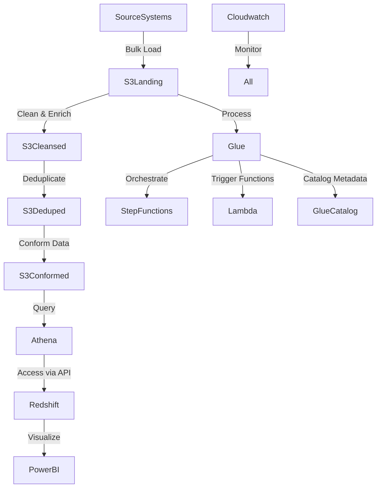

# 💡 **YouTube Analytics Data Pipeline & Power BI Dashboard** 🎥📊

🚀 This project integrates an **AWS-based data pipeline** with an **interactive Power BI dashboard** to analyze YouTube video trends. It leverages **AWS S3, AWS Lambda, AWS Glue, and Power BI** to process and visualize key performance metrics like **views, likes, dislikes, and comments** across various channels.

---
## 📸 Power BI Dashboard Screenshot


---

## 🎯 Problem Statement

Analyzing YouTube trending videos requires a structured pipeline that ensures:
- **Data Integrity** – Cleaning raw JSON data and ensuring schema consistency.
- **Scalability** – Efficient processing of large datasets using AWS services.
- **Actionable Insights** – Enabling dynamic data exploration through Power BI.

### **Objectives**
✅ Ingest & clean raw YouTube trending data.  
✅ Process and transform data using AWS Glue and Lambda.  
✅ Generate key performance metrics with Power BI DAX.  
✅ Visualize trends such as top channels and user engagement over time.  

---

## 🏗️ **Project Architecture**


📌 **Data Flow Overview:**
1. **Data Collection:** YouTube trending videos data is fetched and stored in S3.
2. **Data Processing:** AWS Lambda and AWS Glue transform raw JSON data.
3. **Data Storage:** Cleansed and structured data is stored in S3 using Parquet format.
4. **Data Visualization:** Power BI extracts insights from processed data.


---
## 🚀 Tech Stack

| Category         | Tools & Technologies |
|-----------------|---------------------|
| **Cloud Services** | AWS S3, AWS Lambda, AWS Glue |
| **Processing** | Python, Pandas, AWS Wrangler |
| **Visualization** | Power BI, DAX |
| **Data Formats** | JSON, Parquet |

---
## 📊 **Power BI Dashboard Overview**

### 📌 **Key Features**

#### 🔥 **Main KPI Cards (Top Section)**
📌 **Total Views:** `102bn`  
📌 **Total Likes:** `3bn`  
📌 **Total Dislikes:** `119M`  
📌 **Total Comments:** `283M`  
✅ Provides a **quick snapshot** of audience engagement.

#### 🎛️ **Filters & Navigation (Left Panel)**
✔ **Trending Date Filter**  
✔ **Channel Title Filter**  
✔ **Comments Disabled Filter**  
✔ **Video Error/NA Filter**  
✔ **Table View Button** to access detailed video data.

#### 📈 **Time Series Analysis (Top Right Section)**
📊 **Dislikes, Likes & Comments by Trending Date**  
📌 Tracks user interactions over time.

#### 🏆 **Channel Performance Analysis (Bottom Section)**
📊 **Views & Engagement by Channel Title**  
📌 **Top Engaged Channels:** `PewDiePie, SpaceX, CaseyNeistat`

#### 📜 **Tabular Data View (Bottom Left)**
🔎 Displays video-specific insights like **thumbnail, title, publish time, and availability**.

---

## ☁️ **AWS Data Pipeline for YouTube Analytics**

### 📂 **Data Loading (data_loading.sh)**
This script uploads raw YouTube statistics data to an **Amazon S3 bucket** using Hive-style partitioning.

```bash
aws s3 cp . s3://de-on-youtube-raw-useast1-dev-mohit/youtube/raw_statistics_reference_data/ --recursive --exclude "*" --include "*.json"
# Copy data files by region
aws s3 cp CAvideos.csv s3://de-on-youtube-raw-useast1-dev-mohit/youtube/raw_statistics/region=ca/
aws s3 cp DEvideos.csv s3://de-on-youtube-raw-useast1-dev-mohit/youtube/raw_statistics/region=de/
aws s3 cp FRvideos.csv s3://de-on-youtube-raw-useast1-dev-mohit/youtube/raw_statistics/region=fr/
aws s3 cp GBvideos.csv s3://de-on-youtube-raw-useast1-dev-mohit/youtube/raw_statistics/region=gb/
aws s3 cp INvideos.csv s3://de-on-youtube-raw-useast1-dev-mohit/youtube/raw_statistics/region=in/
aws s3 cp JPvideos.csv s3://de-on-youtube-raw-useast1-dev-mohit/youtube/raw_statistics/region=jp/
aws s3 cp KRvideos.csv s3://de-on-youtube-raw-useast1-dev-mohit/youtube/raw_statistics/region=kr/
aws s3 cp MXvideos.csv s3://de-on-youtube-raw-useast1-dev-mohit/youtube/raw_statistics/region=mx/
aws s3 cp RUvideos.csv s3://de-on-youtube-raw-useast1-dev-mohit/youtube/raw_statistics/region=ru/
aws s3 cp USvideos.csv s3://de-on-youtube-raw-useast1-dev-mohit/youtube/raw_statistics/region=us/
```

---

### 🖥️ **AWS Lambda Function (lambdaFunction.py)**
Processes YouTube JSON data from S3 and normalizes it into a structured format for storage in AWS Glue Catalog.

```python
import awswrangler as wr
import pandas as pd
import urllib.parse
import os

def lambda_handler(event, context):
    bucket = event['Records'][0]['s3']['bucket']['name']
    key = urllib.parse.unquote_plus(event['Records'][0]['s3']['object']['key'], encoding='utf-8')
    try:
        df_raw = wr.s3.read_json(f's3://{bucket}/{key}')
        df_step_1 = pd.json_normalize(df_raw['items'])
        wr_response = wr.s3.to_parquet(
            df=df_step_1,
            path=os.environ['s3_cleansed_layer'],
            dataset=True,
            database=os.environ['glue_catalog_db_name'],
            table=os.environ['glue_catalog_table_name'],
            mode=os.environ['write_data_operation']
        )
        return wr_response
    except Exception as e:
        print(f'Error processing object {key} from bucket {bucket}: {e}')
        raise
```

---
### ⚡ **AWS Glue Job for ETL (pyspark_glue.py)**
Extracts, transforms, and loads raw YouTube data into Parquet format for analytical queries.

```python
import sys
from awsglue.transforms import *
from awsglue.utils import getResolvedOptions
from pyspark.context import SparkContext
from awsglue.context import GlueContext
from awsglue.job import Job
from awsglue.dynamicframe import DynamicFrame

args = getResolvedOptions(sys.argv, ['JOB_NAME'])

sc = SparkContext()
glueContext = GlueContext(sc)
spark = glueContext.spark_session
job = Job(glueContext)
job.init(args['JOB_NAME'], args)

predicate_pushdown = "region in ('ca','gb','us')"

datasource0 = glueContext.create_dynamic_frame.from_catalog(
    database="db_youtube_raw", 
    table_name="raw_statistics", 
    transformation_ctx="datasource0", 
    push_down_predicate=predicate_pushdown
)

applymapping1 = ApplyMapping.apply(
    frame=datasource0, 
    mappings=[
        ("video_id", "string", "video_id", "string"),
        ("trending_date", "string", "trending_date", "string"),
        ("title", "string", "title", "string"),
        ("channel_title", "string", "channel_title", "string"),
        ("category_id", "long", "category_id", "long"),
        ("publish_time", "string", "publish_time", "string"),
        ("tags", "string", "tags", "string"),
        ("views", "long", "views", "long"),
        ("likes", "long", "likes", "long"),
        ("dislikes", "long", "dislikes", "long"),
        ("comment_count", "long", "comment_count", "long"),
        ("thumbnail_link", "string", "thumbnail_link", "string"),
        ("comments_disabled", "boolean", "comments_disabled", "boolean"),
        ("ratings_disabled", "boolean", "ratings_disabled", "boolean"),
        ("video_error_or_removed", "boolean", "video_error_or_removed", "boolean"),
        ("description", "string", "description", "string"),
        ("region", "string", "region", "string")
    ],
    transformation_ctx="applymapping1"
)

resolvechoice2 = ResolveChoice.apply(
    frame=applymapping1, 
    choice="make_struct", 
    transformation_ctx="resolvechoice2"
)

dropnullfields3 = DropNullFields.apply(
    frame=resolvechoice2, 
    transformation_ctx="dropnullfields3"
)

datasink1 = dropnullfields3.toDF().coalesce(1)
df_final_output = DynamicFrame.fromDF(datasink1, glueContext, "df_final_output")

datasink4 = glueContext.write_dynamic_frame.from_options(
    frame=df_final_output, 
    connection_type="s3", 
    connection_options={"path": "s3://de-on-youtube-cleansed-useast1-dev/youtube/raw_statistics/", "partitionKeys": ["region"]}, 
    format="parquet", 
    transformation_ctx="datasink4"
)

job.commit()
```

---

## 🚀 How to Deploy

1. **Set Up AWS Resources:** Create an S3 bucket and AWS Glue catalog.
2. **Upload Data:** Run `data_loading.sh` to store raw data in S3.
3. **Deploy Lambda:** Configure and deploy the AWS Lambda function.
4. **Run AWS Glue Job:** Execute `pyspark_glue.py` to transform data.
5. **Load into Power BI:** Connect Power BI to the processed dataset and build dashboards.

📌 **This project enables scalable data processing for YouTube analytics with AWS, ensuring efficient data storage, transformation, and visualization!** 🚀☁️
